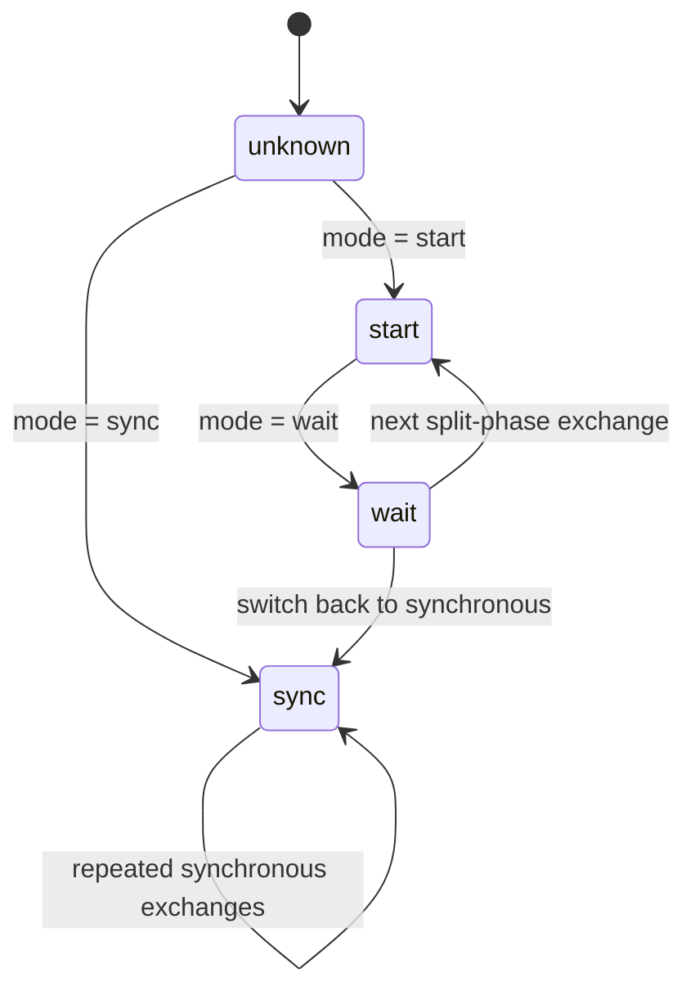

# The communication subsystem

This page describes how a halo (or overlap) exchange is actually carried out
inside PSBLAS, from the public routine down to the MPI calls. It covers the
dispatch path, the communication-handle class hierarchy, the available MPI
schemes, and the swap-status state machine introduced on the
`communication_v2` branch.

> **Audience:** developers modifying or extending PSBLAS communication.
> End users only need the `psb_halo` / `psb_ovrl` entries in the user manual.

## 1. The call stack

A data exchange flows through four layers. The type-specific names below use the
`d` (double) variant; the same pattern exists for `s/c/z/i/l` etc.

```
psb_halo / psb_ovrl                 base/comm/psb_dhalo.f90, psb_dovrl.f90
        |   (public, type-bound generic; one per data type)
        v
psi_swapdata / psi_swaptran         base/comm/internals/psi_dswapdata.F90
        |   (generic internal exchange; resolves the descriptor index list,
        |    allocates/looks up the communication handle, dispatches on scheme)
        v
psi_dswap_<scheme>_vect             same file / helper routines
        |   (one routine per MPI scheme: baseline, neighbor, persistent, rma)
        v
MPI                                  Isend/Irecv, Ineighbor_alltoallv, RMA, ...
```

`psb_halo` itself does very little: it validates the vector, picks the index
list selector (`data`, default `psb_comm_halo_`), the transpose flag (`tran`)
and the communication mode (`mode`, default `psb_comm_status_sync_`), then calls
`psi_swapdata` (or `psi_swaptran` for the transposed exchange).

The real dispatch happens in `psi_dswapdata_vect`
([base/comm/internals/psi_dswapdata.F90](../../base/comm/internals/psi_dswapdata.F90)):

1. `desc_a%get_list_p(data_, comm_indexes, num_neighbors, total_recv, total_send, info)`
   resolves the requested index list (halo / overlap / ext / mov) into the
   per-neighbour send/recv structure.
2. The `swap_status` argument (`mode`) is validated: it must be one of
   `psb_comm_status_start_`, `psb_comm_status_wait_`, `psb_comm_status_sync_`.
3. If the vector does not yet carry a communication handle, one is built from
   the descriptor's scheme: `call psb_comm_set(desc_a%comm_type, y%comm_handle, info)`.
4. The status is stored on the handle (`y%comm_handle%set_swap_status`).
5. A `select case (y%comm_handle%comm_type)` dispatches to the matching
   `psi_dswap_<scheme>_vect` implementation.

## 2. The communication-handle abstraction

Each communication scheme is a class derived from the abstract type
`psb_comm_handle_type`
([base/modules/comm/comm_schemes/psb_comm_schemes_mod.F90](../../base/modules/comm/comm_schemes/psb_comm_schemes_mod.F90)):

```fortran
type, abstract :: psb_comm_handle_type
  integer(psb_ipk_) :: id          = -1
  integer(psb_ipk_) :: comm_type   = psb_comm_unknown_
  integer(psb_ipk_) :: swap_status = psb_comm_status_unknown_
contains
  procedure(psb_comm_set),  deferred :: init
  procedure(psb_comm_free), deferred :: free
  procedure(psb_comm_set_swap_status), deferred :: set_swap_status
  procedure(psb_comm_get_swap_status), deferred :: get_swap_status
end type
```

The handle stores all state that must survive between a split-phase `start` and
its matching `wait`: MPI requests, buffers, communicators, windows. It is
**cached on the vector** (`y%comm_handle`), so repeated exchanges of the same
vector reuse the same buffers and the same (possibly persistent) MPI objects.

A small **factory** builds and recycles handles
([base/modules/comm/comm_schemes/psb_comm_factory_mod.F90](../../base/modules/comm/comm_schemes/psb_comm_factory_mod.F90)):

- `psb_comm_set(comm_type, handle, info)` — allocate (or re-initialise in place)
  the concrete handle matching the integer `comm_type`. If the handle already
  exists with the same `comm_type` it is reset rather than reallocated,
  preserving `id` and `swap_status`.
- `psb_comm_free(handle, info)` — release MPI resources and deallocate.
- `psb_comm_set_swap_status` / `psb_comm_get_swap_status` — thin wrappers over
  the type-bound methods.

## 3. The available schemes

The concrete schemes are enumerated in `psb_comm_schemes_mod` and implemented in
one module each:

| `comm_type` value | Handle type | Module | MPI mechanism |
|---|---|---|---|
| `psb_comm_isend_irecv_` | `psb_comm_baseline_handle` | `psb_comm_baseline_mod.F90` | Point-to-point non-blocking `MPI_Isend` / `MPI_Irecv`; request IDs kept in `comid(:,:)`. This is the default and the historical PSBLAS behaviour. |
| `psb_comm_ineighbor_alltoallv_` | `psb_comm_neighbor_handle` | `psb_comm_neighbor_impl_mod.F90` | Distributed-graph (neighbourhood) collective `MPI_Ineighbor_alltoallv` over an `MPI_Dist_graph` communicator built from the true neighbours. |
| `psb_comm_persistent_ineighbor_alltoallv_` | `psb_comm_neighbor_handle` (with `use_persistent_buffers = .true.`) | `psb_comm_neighbor_impl_mod.F90` | As above, but using a **persistent** neighbour collective request initialised once and reused across exchanges. |
| `psb_comm_rma_pull_` | `psb_comm_rma_handle` | `psb_comm_rma_mod.F90` | One-sided RMA over an `MPI_Win`; each process *gets* (pulls) its halo from peers. |
| `psb_comm_rma_push_` | `psb_comm_rma_handle` | `psb_comm_rma_mod.F90` | One-sided RMA over an `MPI_Win`; each process *puts* (pushes) data into peers. |

All three handle types extend `psb_comm_handle_type` and add scheme-specific
state, for example:

- **baseline** — `comid(num_neighbors, 2)`, the Isend/Irecv request IDs.
- **neighbor** — `graph_comm`, per-neighbour `send_counts/recv_counts` and
  displacements, contiguous `send_indexes/recv_indexes`, plus persistent-request
  bookkeeping (`persistent_request`, `persistent_in_flight`, ...). The topology
  is built lazily on the first exchange and reused.
- **rma** — `win`, the peer layout arrays (`peer_send_*`, `peer_recv_*`,
  `peer_remote_*_displs`) and notification buffers.

## 4. The swap-status state machine

`mode` selects whether an exchange is a single synchronous operation or is split
into two phases so that communication can be overlapped with computation. The
status values live in `psb_comm_schemes_mod`:

```
psb_comm_status_unknown_   (handle not yet used)
psb_comm_status_start_     (post sends/recvs and return)
psb_comm_status_wait_      (complete a previously started exchange)
psb_comm_status_sync_      (start + wait in one call; the default)
```



In the scheme implementations the two phases map onto the obvious MPI pairs, for
example in the baseline scheme:

```fortran
do_send = (swap_status == psb_comm_status_start_) .or. (swap_status == psb_comm_status_sync_)
do_recv = (swap_status == psb_comm_status_wait_)  .or. (swap_status == psb_comm_status_sync_)
```

so `sync` posts and completes in one call, while `start` only posts and `wait`
only completes. **Contract:** between a `start` and its matching `wait` the halo
entries of the vector must not be read or written, and the same vector (which
carries the handle and its in-flight requests) must be passed to both calls.

> Numerical compatibility note: the legacy `psb_swap_send_`/`psb_swap_recv_` bit
> flags still exist in `psb_desc_const_mod`. `IOR(psb_swap_send_, psb_swap_recv_)`
> equals 3, which is the same integer as `psb_comm_status_sync_`, so old callers
> that passed the OR-ed flags keep getting a synchronous exchange.

## 5. Selecting a scheme

The scheme is a property of the **descriptor**, not of the call. The default is
`psb_comm_isend_irecv_` (set in `psb_desc_type`,
[base/modules/desc/psb_desc_mod.F90](../../base/modules/desc/psb_desc_mod.F90)).
To change it:

```fortran
call desc%set_comm_scheme(psb_comm_ineighbor_alltoallv_, info)
```

This only records `desc%comm_type`; the matching handle is built lazily on the
next `psi_swapdata` call (step 3 in §1). Because the choice is global to the
descriptor and orthogonal to the public API, it is intentionally **not** part of
the user manual: end users get correct behaviour from the default, and the
scheme is an advanced tuning knob.

## 6. Adding a new scheme

1. Add an enumerator to `psb_comm_schemes_mod` (`psb_comm_*_`).
2. Create a module `psb_comm_<name>_mod.F90` with a type extending
   `psb_comm_handle_type` and implementing the four deferred methods
   (`init`, `free`, `set_swap_status`, `get_swap_status`).
3. Register it in the factory `psb_comm_set` (`psb_comm_factory_mod.F90`).
4. Add a `psi_<x>swap_<name>_vect` implementation and a `case` for it in the
   `select case` of `psi_<x>swapdata_vect` for every data type, honouring the
   start/wait/sync contract.
5. Wire the new module into the build (`base/modules/Makefile` /
   `base/CMakeLists.txt`).
